# BERT / Transformer Notes

## 张俊林 - 放弃幻想, 全面拥抱 Transformer

* NLP 的四大类问题:
    * 序列标注
    * 分类
    * 句子关系判断
    * 生成式任务
* CNN 对NLP 的改造思路:
    * 由 **1-D 卷积**层来叠加深度, 使用 **Skip Connection** 来辅助优化
    * **Dilated CNN**
    * **GLU** 门控
    * 卷积保留了相对位置信息, 中间不要随手插入 Pooling
    * 例子: ConvS2S, **TCN**
* 文章引用了很多论文的结果来证明"是时候全面拥抱 Transformer"了, 记一下:
    * 性能对比
        * 语义特征提取能力: Transformer > RNN ~= CNN;
        * 长距离特征捕获能力: Transformer ~= RNN > CNN;
        * 任务综合特征抽取能力: Transformer > CNN ~= RNN;
        * 并行计算能及运行效率: 具体要看文本长度和特征长度的对比, 短文本 Transformer > CNN > RNN; 长文本 Transformer 的优势开始下降.
* 参考文献
    * [http://aclweb.org/anthology/P18-1167](http://aclweb.org/anthology/P18-1167)
    * [http://www.aclweb.org/anthology/W18-1819](http://www.aclweb.org/anthology/W18-1819)
    * [http://aclweb.org/anthology/D18-1458](http://aclweb.org/anthology/D18-1458)
    * [http://aclweb.org/anthology/D18-1503](http://aclweb.org/anthology/D18-1503)
    * [https://aclweb.org/anthology/D18-1179](https://aclweb.org/anthology/D18-1179)
    * [http://aclweb.org/anthology/P18-1008](http://aclweb.org/anthology/P18-1008)
    * [https://openreview.net/pdf?id=SkVhlh09tX](https://openreview.net/pdf?id=SkVhlh09tX)

## NLP 的巨人肩膀

* 本文算科普型文章吧, 像 Sebstian Ruder 的系列文章, 记录下他梳理的脉络
    * 梯子出现以前
        * Language modeling
        * NNLM
    * 梯子来了
        * Word2vec
        * GloVe
        * fastText
    * 梯子的一半
        * PV-DM, PV-DBOW
        * Skip-thoughts
        * Quick-thoughts
        * InferSent
        * General Purpose Sentence Representation
        * Universal Sentence Encoder
    * 第二级梯子
        * CoVe
        * ELMo
        * ULMFit
        * GPT
        * BERT

## 奇点机智 系列

### BERT fine-tune 实践终极教程

* BERT 的代码 (TensorFlow) 分为两部分: 预训练和 fine-tune.
* BASE 版的模型设定是 TitanX 或 1080Ti (12GB RAM), WTF?
* 代码中 `processor` 负责对输入的处理, 可参考已经写好的 processor
    * 对于需要完整的`train, dev, test`的任务, 自定义的 processor 需要继承`DataProcessor`, 并重载`get_labels`, `get_train_examples`, `get_dev_examples`和`get_test_examples`. 后三者会被`do_train`, `do_eval`, `do_predict`调用
    * 三个数据加载函数几乎差别, 以`get_train_exmaples`, 需要返回一个由`InputExample`类组成的`list`:
    * `get_test_examples` 可以随意传入 label 值, 预测阶段不会参与计算.

```python
def get_train_examples(self, data_dir)：
    file_path = os.path.join(data_dir, 'train.csv')
    with open(file_path, 'r') as f:
        reader = f.readlines()
    examples = []
    for index, line in enumerate(reader):
        guid = 'train-%d'%index
        split_line = line.strip().split(',')
        text_a = tokenization.convert_to_unicode(split_line[1])
        text_b = tokenization.convert_to_unicode(split_line[2])
        label = split_line[0]
        # guid 用于区分样本
        examples.append(InputExample(guid=guid, text_a=text_a,
                                     text_b=text_b, label=label))
    return examples
```

* 修改完成 processor 后, 需要在 main 函数的 processor 字典中加入.
* `create_model` 函数, 从 modeling.py 获取模型主干输出, 还进行 fine-tune 的 loss 计算. 可以对这部分代码进行修改实现自定义结构的需求.
* Hanxiao 的 `bert-as-service` 了解一下


### 深度解析

* 对于 Mask 的应用, 更早出现在 Data Noising as Smoothing in Neural Network Language Models 中, 原文已经提及.
* 无监督的训练方法受启发于 A Neural Probabilistic Language Model.

## The Illustrated Transformer

* Attention is All you need 的图容易让人费解, 下面这张图好一些, 我知道了是最后一个 encoder 的输出传递给了所有的 decoder.

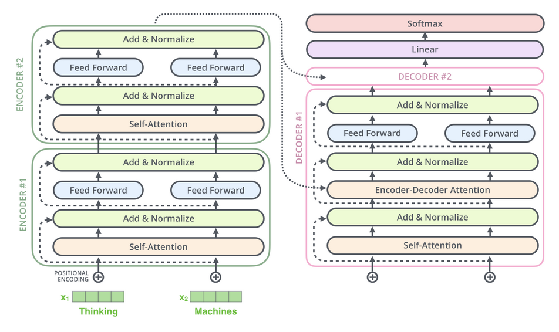

## Dissecting BERT

* 透过这张图, 我终于明白了所谓的 Position Encoding:

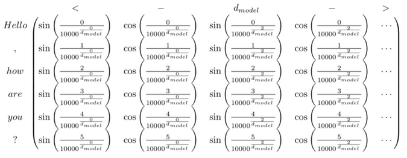

## Deconstructing BERT

* 本文用可视化的方式去探索发现了 BERT 的一些内幕.
* 模式1: (第二层)注意力集中在后一个单词上, 而 [SEP] 的注意力则集中到了 [CLS] 上.

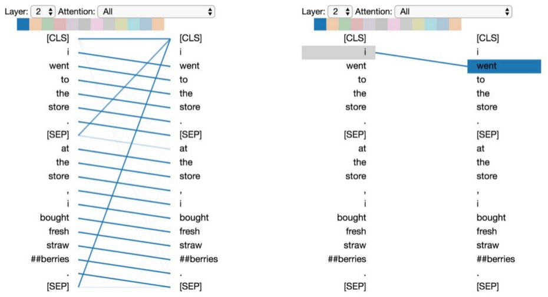

* 模式2: (第六层)注意力集中到前一个单词上, 尤其是很多单词的注意力到集中到了 [SEP] 上.

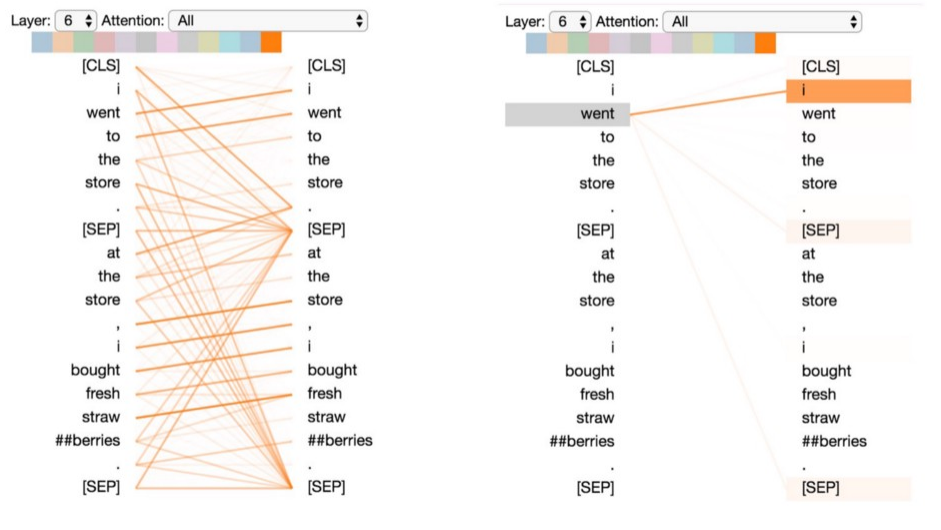

* 模式3: (第二层, 另一个 head)注意力集中到相同或相关的单词上

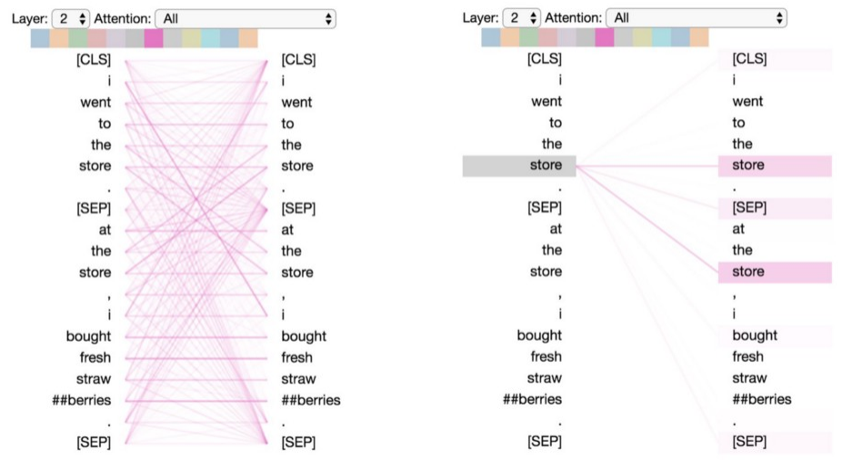

* 模式4: (第十层)注意力集中到另一个句子的相同或相关的单词上 (看起来对 sentence pair 型任务特别有帮助)

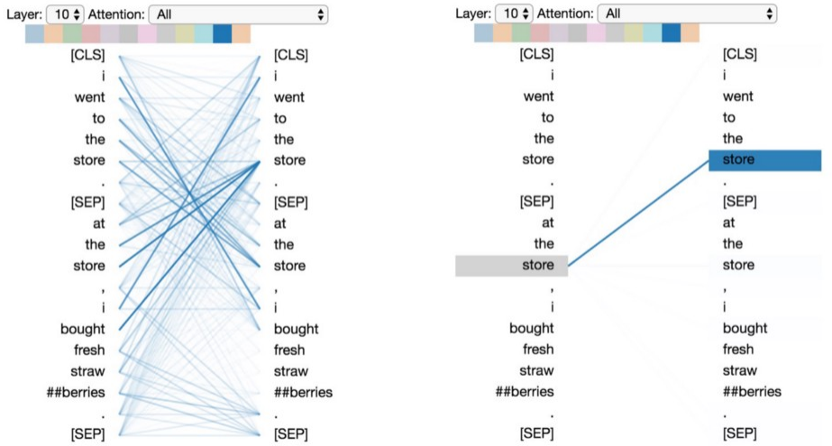

* 模式5: (第2层)注意力集中到预测性的单词上, 从下左图我们又可以看到很多单词的注意力都导向了 [CLS]

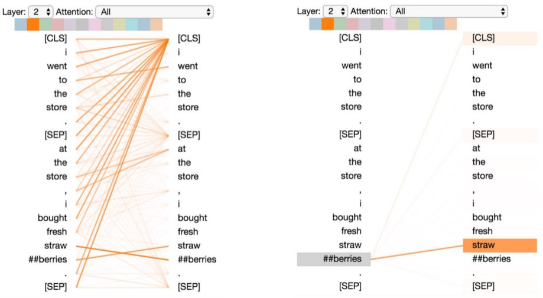

* 模式6: (第六层)注意力集中到分隔符, [CLS] 或 [SEP]. 这可能是模型将 sentence-level 的状态传递到单个 tokens 的表现.

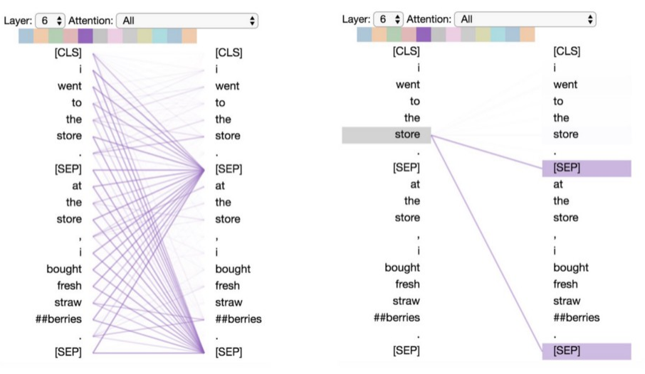

* 下图是 self-attention 的展开, 向量中的蓝色表示正值, 橙色表示负值. 别忘了 self-attention 的, query, key, value 其实都是序列自身, 下图单独拎出了一个向量 q, 表示 the. 上帝视角看到最终注意力集中到了 [SEP] 上, 从 Queray 到 Key 的连线也可以看到注意力的分散. qxk 则展现了具体向量间的交互, 每一位数字是如何为 dot-product 作出贡献的.

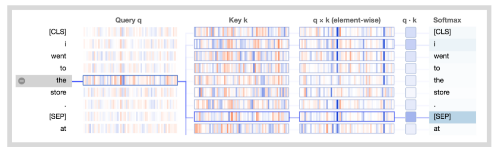

* 下图展示了模式 6 的细节 (注意力是如何集中到 delimiter tokens 的). 可以看到 Key 列已经展现了 [SEP] 的特别: 向量的个别维展现了极大的正值和极小的负值, 而其他大部分维的值接近0.

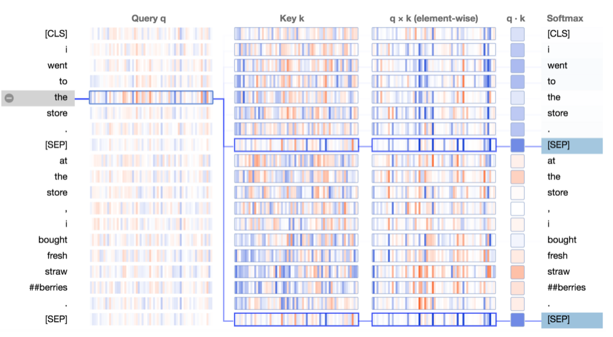

* 将上图放大, 如下, qxk 的结果更凸显了一些维.

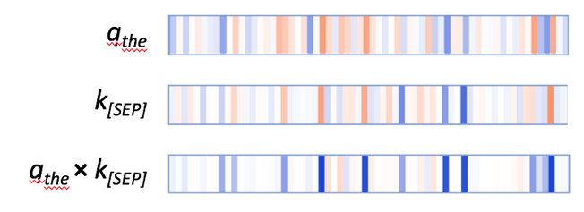

* 其他的单词也具有类似的情况, 注意力集中到 [SEP].
* 一种更少见的模式是, 注意力被平均地分配到同一个句子的每一个单词上, 如下. 该模式的效果是: 将 sentence-level 的状态分布到 word level, 就像 求了 word embeddings 的平均 (Bag-of-Words).

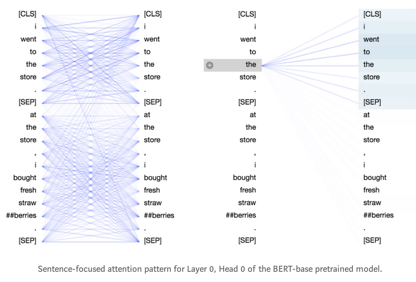

* 将上图的细节展开, 如下. 两个句子中单词的向量就明显的分化了,一个多负值, 一个多正值. qxk 的结果分化得更厉害, 同一个句子中的单词表现出强正值, 而另一个句子中的单词则表现出强负值.

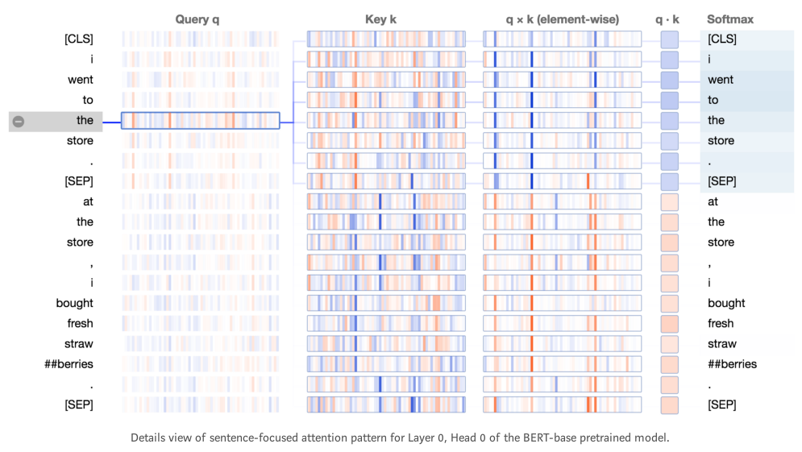

* 不过注意了, 以上是第零层的注意力模式, BERT 在输入中增加了 segment embeddings 的.
* 下图是模式 1 的细节. qxk 表现出明显的正值.

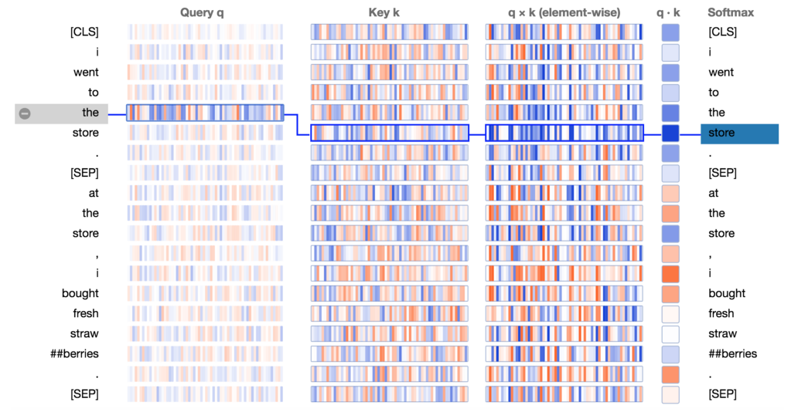

* 作者又将不同的相邻的 qxk 的结果展示了出来, 如下. 依旧是大量的正值, 似乎有某种趋势在其中, 与相邻位置有关. 可以理解, 这想必要归功于 position encoding 了.

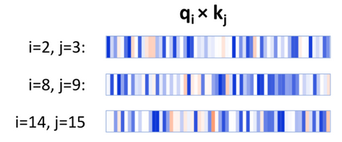

## Multi-label Text Classification using BERT – The Mighty Transformer

* 我真是被禁锢住了, 按照这篇文章的说法, 它成功地测试了 BERT 的能力, 下一步是用目标任务的语料再预训练 BERT (MLM 和 NSP), 相当于在 BERT 外面套了一层 ULMFiT, 然后再对预训练的模型进行 fine-tuning 和检验测试.
