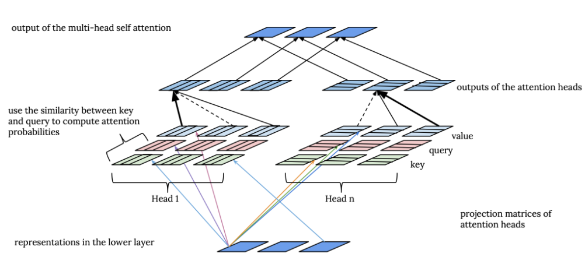
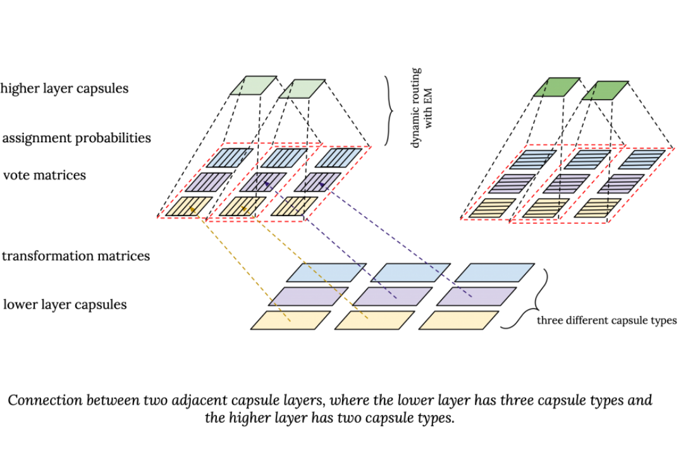
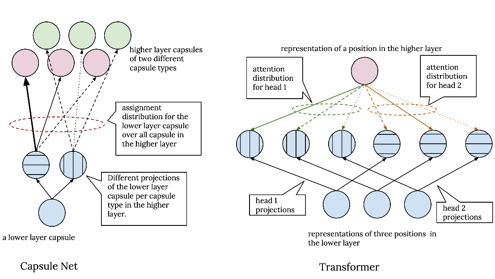

# From Attention in Transformer to Dynamic  Routing in Capsule Nets

## Matrix Capsules with EM Routing:

- The idea is that in order to recognize parts of an objects, you need to first have a general understanding of what the object is. In other words, we need to have both top-down and bottom-up flow of information.
  - 我目前从定义-例句学习词向量的方法有点这样的味道: 从例句提取出上下文需要的该单词的语义, 再从单词定义中去搜索匹配相关语义, 最终得到单词的语义.
- A capsule is a unit that learns to detect an implicitly defined **entity** over a limited domain of viewing conditions.
- It outputs both the **probability** that the entity is present and **a set of "instantiation parameters"** that reflect the features of the entity.
- The presence probability is viewpoint invariant (随观察点不变), the instantiation parameters are viewpoint equivariant (视角等变, 即随着实体的移动或旋转而变)
- In [matrix capsules with EM routing](https://openreview.net/pdf?id=HJWLfGWRb), each capsule layer has a fixed number of capsule types (similar to filters in CNN). (胶囊类型, 功能上等价于 CNN 的过滤器)
- A capsule is an instance of a capsule type. (一个胶囊是一个胶囊类型的实例)
- Each capsule type is meant to correspond to an entity and all capsules of the same type are extracting the same entity at different positions. (每个胶囊类型对应一个实体, 同一类型的所有胶囊表征同一个实体在不同视角下的特征)
- In capsule nets, the number of capsule types in each layer is predefined. Between every capsule type in two adjacent layers, there is a transformation matrix. This way each higher  layer capsule, sees the entity in the lower layer from a different point of view. (相邻两层的每个胶囊类型间, 用一个转换矩阵, 高层胶囊可以观察到低层胶囊的不同形态的表示)
- 胶囊的激活概率, 一个简单的形式是: 激活它的代价与不激活它的代价的差 (这里的激活代价可以说低层胶囊的投票结果, 按 attention 的观点, 投票可以是任意 0~1 的值). **需要动态路由来解决**
- We want the connections between higher and lower layer capsules to not only depend on the presence of the lower layer capsules, but also based on their **(lower layer capsules') relevance to each other** as well as to the  higher layer capsule.
- We can use **EM** to compute representations of higher layer capsules based on the representations of lower layer capsules and the assignment probabilities of the lower layer capsules to the higher layer capsules. (用来学习 definition embedding 刚刚好呀)
- 对于初级胶囊层, 其下不是胶囊层, 它由下层的输出线性转换而来, 而它们的激活是下层输出的加权和的 sigmoid (???)
- `Coordinate Addition`

## Capsule Nets vs Transformers

### Dynamic Routing vs Attention

- **In capsule nets the assignment probabilities are computed bottom up, whereas in transformer the attention is computed  top down.**
- **The attention weights in transformer are distributed over the representations in lower layers, but in capsule nets, the assignment probabilities are distributed over the higher layer capsules.** (所以后者更像投票)
- In transformer, the attention probabilities are computed based on the similarity of the representations in the same layer, but this is equivalent to the assumption that ***the higher layer is first initialized with the representations from the lower layer and then it is updated based on the attention probabilities computed by comparing this initial representations with the representations from the lower layer.***
- The bottom up attention in capsule nets along with having a presence probability and the penalty for activating capsules, explicitly allows the model to abstract away the concepts as the information propagates to the higher layers. (自下而上的注意力, 搭配概率和惩罚, 使得模型在信息向高层传播的过程中, 能够抽象化概念)
- In transformer, the top down attention mechanism allows the nodes in the higher layer not to attend to some of the nodes in the lower layer and filter out the information that is captured in those nodes. (自上而下的注意力, 能摒弃掉一些信息)
- The challenge in capsule nets is that we don't have any prior assumption on the representations of the higher layer capsules since what they are supposed to represent are not known in advance. (所以需要动态路由)

### Capsule Types and Attention Heads

- In capsule nets, there is a different transformation matrix between each pair of capsule types from two adjacent layers, thus capsules that are instantiations of different capsule types view the capsules in the previous layer from a different point view. (不同的转换矩阵旨在让高层胶囊能从不同视角观察低层胶囊)
- Capsules with different types have a different point of view (不同类型的胶囊有不同的视角), in the end, assignment probabilities for a capsule in the lower layer are normalized over all capsules in the higher layer regardless of their type. Hence we have one assignment distribution per each capsule in the lower layer. (向上投票的时候, 每个胶囊分配出去的票数总和是 1)
- In transformer, *each attention head independently processes its input*. This means we have a separate attention distribution for each position in the higher layer, and the outputs of the attention heads are only combined in the last step, where they are simply concatenated and linearly transformed to compute the final output of the multi-headed attention block. (多头独立处理, 最后再汇总)

### Positional Embedding and coordinate addtion

- 这两种机制都旨在显式地加入位置特征.
- Position embedding 在输入层之前加入; coordinate addition 在最后一层进行.

### Structured hidden representations

- In capsule nets, instead of scalar activation units in standard neural nets, we have capsules where each one is represented by **a pose matrix and an activation value**. The pose matrix encodes the information about each capsule and is used in dynamic routing to compute the similarity between lower layer capsules and higher layer capsules. (Pose matrix 编码了每个胶囊的信息, 在动态路由的相似性计算中被使用). The activation probability determines their presence and absence.
- In transformer, the structured representations are decomposed into key, query, value triplets, where key and query are addressing vectors used to calculated the similarity between different parts of the input, and compute the attention distribution to find the extent to which different parts of the input contribute to each other representations. (Transformer 用 Key 和 Query 来计算相似性)
- In very loose terms, the pose matrix in capsule nets plays the role of key and query vectors in transformers.
- There seems to be some advantage in disentangling representations that are encoding different kinds of information.