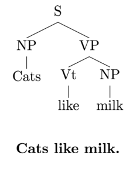
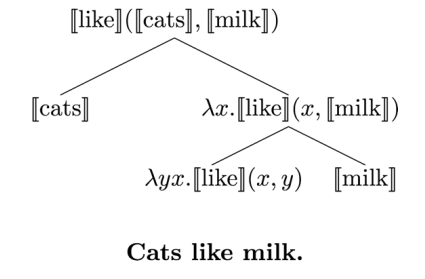

# Sentence Representations

## Classical Perspective

- Sentence representations are logical expressions
- Sentence understanding is parsing and combing constituents to obtain logical form
- Syntax guides semantics
  - Syntactic Analysis
  - Semantic Interpretation

- Pros:
  - Intuitive and interpretable representations
  - Leverage the power of predicate logic to model semantics
  - Evaluate the truth of statements, derive conclusions, etc.
- Cons (inconvenient truth):
  - All meaning is context-dependent
  - Metaphoricity (隐喻性) is the rule, not the exception
  - Meaning is not in language, language indicates meaning

## Sentence Representations in Neural Nets

- Nothing is an atom, everything a molecule (in theory)
- Linguistic signal (e.g., words), perceptual clues (e.g., vision), and semantic knowledge **all represented similarly**
- Representations of one information type **constrain and interact with** representations of others
- Perception and conceptual knowledge?
  - Knowledge from stories - Skip-Thought Vectors
  - Fast knowledge from stories - Learning distributed representations of sentences from unlabeled data
  - Knowledge from raw text - Sequential Deniosing Auto-Encoder
  - Knowledge from dictionaries
  - Knowledge from images
- Richer representation spaces
  - Auto-encoding for representation learning
  - Auto-encoding via a richer latent space
  - VAE: variational auto-encoder
  - VAE for text
  - Benefits of VAE
    - Smooth(er) latent space of representations
    - Generate from the model

## Conclusions

- The meaning of language is not the language itself
- Neural networks provide a model for combining the necessary information sources
- Finding and using the right information is just as important as elaborate modelling

