# Nevermore - An AI Poet

## 微软绝句

* 基于`统计机器翻译模型`作诗, 前后句分别作为翻译的 source 与 target (真的是翻译, 而且是从头到尾的翻译)
* 使用 word vector 对主题词进行扩展. 比如"怀古", 扩展之后得到"览古", "吊古", "凭吊", "怀惜"等.
* 首句使用 Beam Search 拼凑.
* 使用 `Mutual Information` 度量诗句间的意境关联, 公式如下. A 表示当前生成诗句的词集合, B 表示之前所有诗句包含的词集合, Si 和 Sj 分别为 A 和 B 中的词, p(Si, Sj) 表示 Si, Sj 同时出现的概率, p(Si) 表示 Si 出现的概率.

## i, Poet: Automatic Poetry Composition through Recurrent Neural Networks with Iterative Polishing Schema

* 基于诗人作诗会首先列一个大纲 (keywords), 然后对创作的诗作不断润色, 直到完成. iPoet 就模拟了这个过程.
* 以 encoding-decoding 的机制作诗. 用户的创作意图用`single vector, 单个向量`表示, 然后 decode the vector to a whole poem. 就是这么简单粗暴.

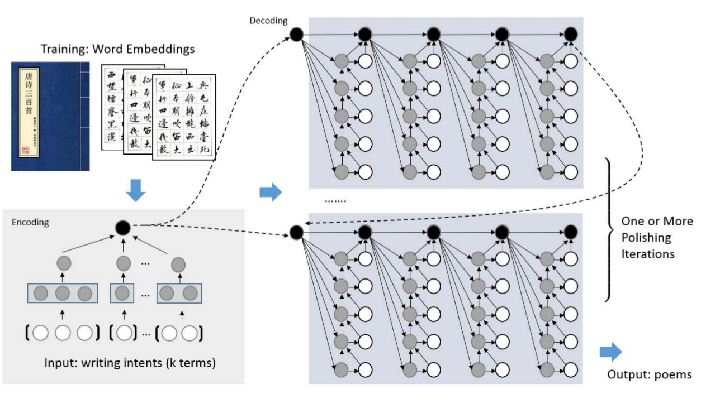

* 系统架构如上, 包括了:
    1, Intention representation: 接收用户输入的 keywords, CNN or RNN 用于 capture the meaning of a particular term, 然后通过一个 pooling layer 得到一个 single vector 表示用户的创作意图.
    2. Sequential generation: 条件于上一步得到的 single vector, 使用 RNN 逐字生成. 实际上使用了`hierarchical architecture, 分层架构`, 一个 RNN 用于表示每一行的 global information, 基于一行的所有字产生; 另一个 RNN 表示 local information, 用于指导下一个字的生成.
    3. Interative polishing: 基本同上一步 Sequential generation. 只是上一步生成的草稿也作为用户的写作意图. 不断迭代.
* 在 Sequential generation 阶段, global rnn's hidden vector 的更新公式: 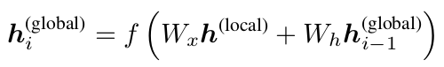. local rnn's hidden vector 计算公式: 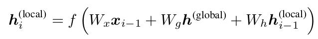. 可以看出, local rnn 的输入包括: previous word, global hidden vector, local hidden vector. 按照文章的说法: it input is the word embedding of the previous character, augmented with the global information vector, as a `static attention mechanism`.
* 在 Interative polishing 阶段, global rnn's hidden state 作为 the gist of the overall semantic representation of the poem, 使用如下公式计算新的创作意图: 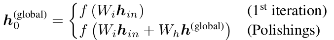
* 以前后两次作诗得到的 global h 的 cosine similarity 作为停止标准, 超过一直阈值就停止润色. 另外, 还有一个最大迭代次数.
* **训练时, 以诗的标题作为写作意图**, objective function 就是 cross entropy + l2 regularization term.

## Chinese Poetry Generation with Planning based Neural Network

* 基于列大纲的创作方法来作诗. 上一篇也提到了也列大纲, 但采用的方法比较简单, 主要在于 iterative polishing. 而本文的重点就在于 Plan, 提出的方法称作: planning-based poetry generation.
* 不采用 iterative poblishing, 将作诗分成了两步: Poem Planning, Poem Generation
* 我觉得本文提出的 Poem Planning 的思路挺好的, 详细介绍下

### Poem Planning

* 同样假定用户输入是 sequence of words. 但此时的 number of words 并不是最终使用的 number of keywords. 作诗所用的 keywords, 每一个作为一句诗的 sub-topic, 因此其数量等于诗的行数, 是从用户输入中提炼出来.
* 当用户输入大于所需关键词数时, 使用 TextRank 算法 (graph-based ranking algorithm based on PageRank) 来评估每个字的重要性, 选择所需数量的最重要的 N 个关键词. TextRank 算法的思路是: 每个 candicate word 作为图中的一个`顶点, vertex`, 两个字同时出现时, 则在这两个顶点间加一条`边, edge`, 边的权值根据两个单词同时出现的总数. 具体计算公式如下:

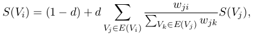

* 上式中, w_ij 就是顶点 Vi 与 Vj 间的边权, E(Vi) 是与 Vi 相连的点集, d 是`阻尼因子, damping factor`, 一般取 0.85. S(Vi) 的初始化为 1.0.
* 当用户输入少于所需关键词数时, 要扩充新的关键词. 文中提出了两种方式:
    1. RNNLM-based method: 即根据前面的关键词预测后续可能的关键词. 这就要求有一个可用于预测关键词的训练集. 本文的做法是, 从诗中提取, 具体是: 一首 N 行的诗, 按照上面一个关键词对应一行的说法, 可以提取出 N 个关键词. 于是, 作者用 TextRank 对诗句中的每个字计算其重要性, 得分最高的那个, 作为这一句诗的 sub-topic, 亦即 keyword.
    2. Knowledge-based method: RNNLM-based 方法看着很好, 但它只能预测能从诗句中提炼出的关键词. 如果诗句并没有覆盖到前面的用户输入 (比如用户输入了一个"火车"), 那就无法预测其下一个关键词了. 对此, 作者提出了 knowledge-based method, 说白了就是搜索. 具体地, 给定一个关键词 k, 找到能最好描述它的词作为扩充的关键词. (文中的例子是, "冰心"引伸出"繁星", "春水") 文中给出了扩充关键词必须同时满足的几个条件:
        1. 在搜索的资料 (知识) 中, 扩充关键词与 k 的距离不得超过 5;
        2. 扩充关键词的词性必须是形容词或名词 (TextRank 的论文中指出, 这两类词对于 Key Extraction 的效果最好);
        3. 扩充关键词被诗集的词汇表覆盖了. (这一点很好理解, 不然会作不出诗的)
* 诗的生成过程, 每一行都对应一个关键词. 由于 sub-topic 是用户指定的, 或者派生出的, 一定程度上防止了离题. 文中指出, 这个过程可以理解成是 seq2seq 的映射问题, 不同在于是`2:1`的映射.

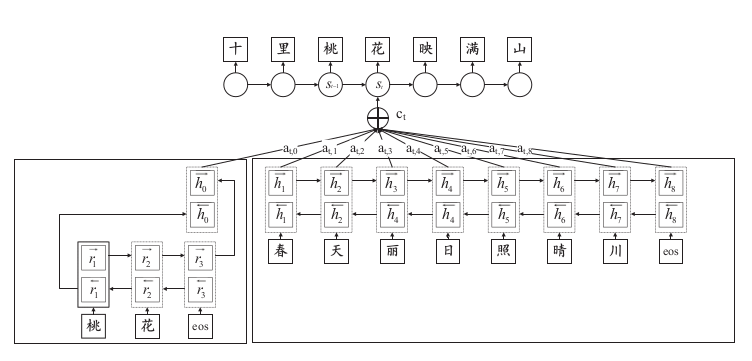

* 如上图所示, 诗句对应的 keyword 首先被 encode 成 a seqeuence of hidden states [r1: r_{Tk}], 然后已生成的诗句被 encode 成另一组 hidden states [h1: h_{Tx}]. 均使用 Bi-GRU. 因此将 [r1: r_{Tk}] `concatenate` 成一个向量: 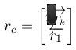, 作为 h0 (h0=rc). 因此 h=[h0: h_{Tx}] 就表示了 keywords 和诗句的语义.
* 本文采用 encoder-decoder 的机制来作诗, 利用公式 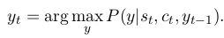 来生成字眼. 其中 st 是 decoder's internal status vector , ct 是 context vector 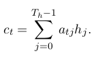, y_{t-1} 是生成的前一个字.
* 本文在 encoder-decoder 机制之外, 还引入了 attention 机制, 上式中的 ct 就是由 attention 推荐的, 其中 a_{tj} 计算如下: 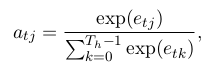, 而 e_{tj} 是 attention score on hj at time step t: 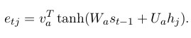
* 其他训练的细节包括:
    1. 训练集中的诗句使用基于`条件随机场, CRF`的分词进行分割, 然后使用 TextRank 算法计算各 keywords 的得分;
    2. knowledeg-based expasion 使用百度百科和维基百科作为知识库

## Chinese Poetry Generation with Recurrent Neural Networks

* 成诗分两步走:
    1. 将用户输入的 keywords 扩展成相关短语的集合, 实际是在**诗学含英**中找出对应意象的常用词, 组合生成首句;
    2. 之后每个字的生成都依据前面所有的句子和当前句的前面所有字, 在生成过程 (非训练) 中, 还必须考虑平仄, 押韵的限制.
* 生成首句的具体做法是, 根据得到的诗学含英的词集, 生成所有符合平仄的诗句. 然后用一个`language model`对候选句进行`排名, rank`, 选择最好的一句. 此过程依赖 `character-based RNNLM`, Kneser-Ney trigram, `stack decoder`.
* 生成过程的依据则是: 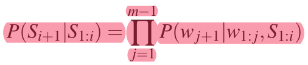. 也正如上所说, P(S_{i+1}\|S_{1:i}) 取决于之前生成的诗句以及当前行生成的所有字. 具体而言, 首先, 使用一个`convolutional sentence model, CSM`将前面的 i 行诗句 S_{1:i} 被 endode 成 i 个向量 v_{1:i}; 然后一个`recurrent context model, RCM`以 v_{1:i} 为输入, 输出一个 u_i^j, 用于生成第 i+1 行的 j+1 个字; 最后 u_i^{1:j} 和第 i+1 行的前面 j 个字 w_{1:j} 作为`recurrent generation model, RGM`的输入, 输出下一个字的概率. 如下:

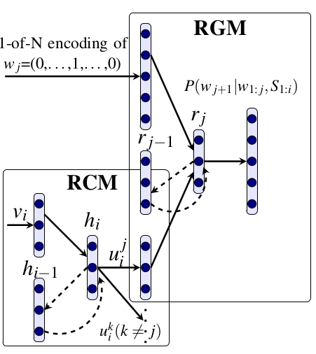

* CSM 的任务就是将一句诗 encode 成一个 vector, 理论上可以使用任何将诗句 encode 成 vector 的模型, 包括 RNN. 本文使用的 CSM 是基于 n-gram 的, 其初衷是, `词性标注, POS-tagging`或`分词, Segmentation`对于古诗没什么意义. 下图是 CSM 的事宜. (在 iPoet 中指出, 标题使用 RNN encode 成一个向量的结果更好, 所以不妨使用 RNN-based sentence model 代替 CSM)

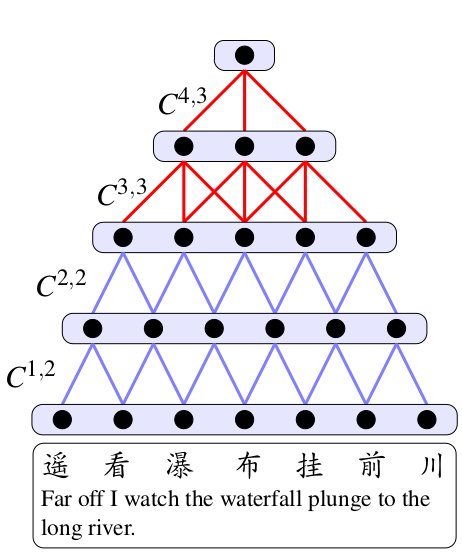

* RCM 的任务是将表示前面个 i 行诗的 i 个向量压缩为一个 context vector (相对于每个字的生成而言). 首先是算得一个 RCM 的 hidden state 向量, 然后再将其 decnode 成多个不同的向量, 每个对应当前要生成的诗句各位置的字, 输出是这些向量的序列. 鉴于训练数据是五言或七言的诗句, 文中将 RCM 的输出层固定使用了 2 套参数, 一套对应五言诗, 一套对应七言诗 (文中没有提及具体如何切换, 等我实现了再来解答) 看看计算过程, 也许能更好地理解:

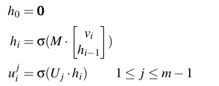

* RGM 以当前诗句已生成字为输入, 并额外输入 RCM 得到的 context vector, 就是改进版的 Char-RNN.
* 为了加速训练, 文章设计用了 `word-classing`的方法. 就是将 vocab 中的所有字先分一个类. 计算字的概率是, 先估计其所述类的概率, 然后字的概率条件于字类的概率.
* 在生成诗 (非训练) 时, 使用了`Machine Translation Features`: `inverted phrase translation model feature`和`inverted lexical weight feature`来保障诗句间的连贯性.
* 而为了保障诗句内的平仄押韵与诗意, 又使用了一个`language model feature`: Kneser-Ney 3-gram model.
* 整首诗的韵律由首句而定. 文中指出, 使用`stack decoder`作为 decoder, 使用 MERT training 来学习 decoder 的特征权值. (暂时不知道什么是 stack decoder)
